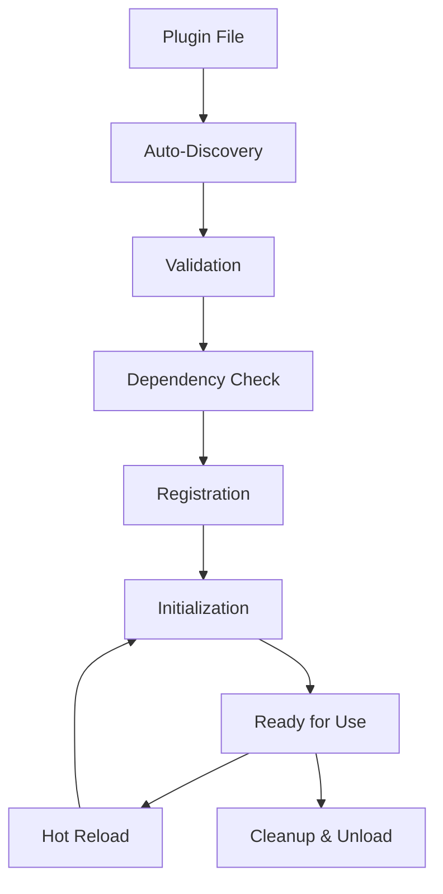

# 🏗️ Framework Overview

RAG Builder is designed as a **zero-configuration, dynamic plugin framework** that makes building RAG applications as simple as writing Python functions. This document explains the core architecture, design principles, and how everything fits together.

## 🎯 **Design Philosophy**

### **Zero Configuration**
- **No manifests required** - Plugins are discovered automatically
- **No registration code** - Functions become capabilities automatically
- **No boilerplate** - Minimal code needed to create powerful plugins
- **No restart required** - Hot reloading for instant development

### **Maximum Flexibility**
- **Any Python callable** can become a plugin capability
- **Dynamic routing** - Framework automatically routes calls to plugins
- **Runtime composition** - Plugins can be loaded/unloaded at any time
- **Extensible architecture** - Every part of the framework can be extended

### **Enterprise Grade**
- **Production-ready performance** with smart caching and optimization
- **Comprehensive error handling** with recovery strategies
- **Advanced monitoring** with real-time metrics and analytics
- **Security-first design** with multi-layer validation

## 🏛️ **High-Level Architecture**

```
┌─────────────────────────────────────────────────────────────────┐
│                         User Interface                          │
│                    (Web UI, CLI, API)                          │
└─────────────────────┬───────────────────────────────────────────┘
                      │
┌─────────────────────▼───────────────────────────────────────────┐
│                      Manager Layer                              │
│              (Simple API, Convenience Methods)                  │
└─────────────────────┬───────────────────────────────────────────┘
                      │
┌─────────────────────▼───────────────────────────────────────────┐
│                    Core Framework                               │
├─────────────────────────────────────────────────────────────────┤
│  🔍 Discovery  │  ⚡ Routing   │  📊 Metrics  │  🛡️ Security    │
│  🔄 Loading    │  💾 Caching   │  🚨 Errors   │  ⚖️ Balancing   │
│  🔌 Registry   │  🎯 Events    │  📈 Monitor  │  🔧 Config      │
└─────────────────────┬───────────────────────────────────────────┘
                      │
┌─────────────────────▼───────────────────────────────────────────┐
│                   Plugin Ecosystem                              │
├─────────────────────────────────────────────────────────────────┤
│  📄 Data Sources     │  🧠 LLMs           │  🗃️ Vector DBs      │
│  🔧 Processors       │  🎯 Embeddings     │  🔍 Search Engines  │
│  🌐 APIs & Services  │  📊 Analytics      │  🔒 Security Tools  │
└─────────────────────────────────────────────────────────────────┘
```

## 🔧 **Core Components**

### **1. Framework Core (`backend/core/framework.py`)**

The heart of the system that provides:

```python
class Framework:
    """Core framework with zero-config plugin management"""
    
    # Core functionality
    - Plugin registration and lifecycle management
    - Capability discovery and routing
    - Event system for plugin communication
    - Advanced error handling and recovery
    
    # Performance features
    - Smart caching with LRU cleanup
    - Load balancing across plugin instances
    - Real-time metrics collection
    - Performance optimization
    
    # Enterprise features
    - Plugin validation and security
    - Dependency resolution
    - Configuration management
    - Middleware support
```

### **2. Plugin Loader (`backend/core/loader.py`)**

Intelligent plugin discovery and loading:

```python
class Loader:
    """Auto-discovers and loads plugins with zero configuration"""
    
    # Discovery methods
    - Scans filesystem for Python files and directories
    - Detects plugin manifests (optional)
    - Finds plugin classes and functions automatically
    - Handles nested plugin structures
    
    # Loading strategies
    - Direct function imports (zero-config)
    - Class-based plugins with inheritance
    - Manifest-driven plugins (traditional)
    - Wrapper plugins for existing code
```

### **3. Manager Interface (`backend/core/manager.py`)**

Simple, powerful API for developers:

```python
class Manager:
    """Simple interface to the framework"""
    
    # Core operations
    async def call(capability, *args, **kwargs)     # Call any capability
    async def call_all(capability, *args, **kwargs) # Call on all providers
    async def emit(event, data)                     # Emit events
    
    # Management
    def list_plugins()                              # Plugin inventory
    def list_capabilities()                         # Capability discovery
    def get_metrics()                              # Performance data
    
    # Advanced features
    def add_validator(func)                        # Custom validation
    def add_error_handler(type, func)              # Error recovery
    def set_config(key, value)                     # Configuration
```

## 🔌 **Plugin Architecture**

### **Plugin Types**

RAG Builder supports multiple plugin patterns:

#### **1. Zero-Config Functions**
```python
# plugins/my_functions.py
def clean_text(text: str) -> str:
    return text.strip().lower()

def count_words(text: str) -> int:
    return len(text.split())

# Framework auto-discovers these as capabilities!
```

#### **2. Simple Classes**
```python
from rag_builder_sdk import QuickPlugin

class MyPlugin(QuickPlugin):
    def process_data(self, data):
        return f"Processed: {data}"
    
    def transform_text(self, text):
        return text.upper()
```

#### **3. Advanced Plugins**
```python
from rag_builder_sdk import LLMPlugin, capability, event_handler

class SmartLLMPlugin(LLMPlugin):
    @capability("Generate intelligent responses")
    async def generate_text(self, prompt: str) -> str:
        # Implementation here
        return response
    
    @event_handler("system_startup")
    async def on_startup(self, event_data):
        print("🤖 Smart LLM ready!")
```

### **Capability System**

Every public function or method in a plugin becomes a **capability**:

```python
# This function...
def analyze_sentiment(text: str) -> str:
    return "positive" if "good" in text else "negative"

# ...becomes this capability
await manager.call("analyze_sentiment", "This is good news!")
# Returns: "positive"
```

### **Plugin Lifecycle**



## ⚡ **Dynamic Routing**

The framework provides intelligent capability routing:

### **1. Automatic Discovery**
```python
# Framework automatically discovers all capabilities
capabilities = {
    "clean_text": ["text_processor", "advanced_nlp"],
    "generate_text": ["openai_llm", "ollama_llm"],
    "search_vectors": ["chroma_db", "faiss_db"]
}
```

### **2. Smart Selection**
```python
# Framework selects the best plugin automatically
result = await manager.call("generate_text", prompt)

# Or specify a particular plugin
result = await manager.call("generate_text", prompt, plugin_id="openai_llm")

# Or call all providers
results = await manager.call_all("generate_text", prompt)
```

### **3. Load Balancing**
```python
# Framework balances load across multiple instances
for i in range(1000):
    # Automatically distributes across available plugins
    result = await manager.call("process_data", data[i])
```

## 📊 **Performance Architecture**

### **Smart Caching**
```python
# Automatic caching based on capability patterns
@cache_result(ttl=3600)  # Automatic for pure functions
def expensive_computation(data):
    return complex_analysis(data)

# Manual cache control
result = await manager.call("process", data, use_cache=False)
```

### **Metrics Collection**
```python
# Built-in performance monitoring
metrics = manager.get_metrics()
{
    "calls": 1543,
    "cache_hits": 892,
    "cache_hit_rate": 0.578,
    "error_rate": 0.002,
    "avg_response_time": 45.2
}
```

### **Load Balancing Strategies**
- **Round-robin**: Distribute calls evenly
- **Least-used**: Route to least-loaded plugin
- **Performance-based**: Route to fastest plugin
- **Capability-specific**: Custom routing per capability

## 🛡️ **Security Model**

### **Multi-Layer Validation**

1. **Plugin Validation**
   ```python
   # Custom validators
   def security_validator(plugin):
       return plugin.plugin_id.startswith("trusted_")
   
   manager.add_validator(security_validator)
   ```

2. **Capability Validation**
   ```python
   # Schema-based validation
   @provides_schema({
       "input": {"type": "string", "max_length": 1000},
       "output": {"type": "dict"}
   })
   def process_text(text: str) -> dict:
       return {"result": text.upper()}
   ```

3. **Runtime Security**
   ```python
   # Sandbox execution (future)
   # Resource limits per plugin
   # API key management
   ```

### **Error Handling & Recovery**

```python
# Comprehensive error handling
async def llm_error_handler(error, context):
    # Try backup LLM
    return await manager.call("generate_text", 
                            context["prompt"], 
                            plugin_id="backup_llm")

manager.add_error_handler("llm_timeout", llm_error_handler)
```

## 🔄 **Event System**

### **Plugin Communication**
```python
# Plugins can communicate via events
@event_handler("document_processed")
async def on_document_ready(event_data):
    document = event_data["document"]
    await manager.call("index_document", document)

# Emit events from anywhere
await manager.emit("document_processed", {"document": doc})
```

### **System Events**
- `plugin_loaded` - When a plugin is loaded
- `plugin_unloaded` - When a plugin is unloaded
- `error` - When errors occur
- `performance_warning` - When performance thresholds are exceeded

## 🔧 **Configuration System**

### **Global Configuration**
```python
# Framework-wide settings
manager.set_config("cache_size", 10000)
manager.set_config("timeout", 30)
manager.set_config("log_level", "INFO")
```

### **Plugin Configuration**
```python
# Per-plugin configuration
class MyPlugin(BasePlugin):
    def __init__(self, **config):
        super().__init__(**config)
        self.api_key = config["api_key"]
        self.model = config.get("model", "default")
```

## 🎯 **Design Principles**

### **1. Zero Configuration**
- Plugins work without any setup or configuration
- Framework discovers and loads everything automatically
- No YAML, JSON, or configuration files required

### **2. Maximum Flexibility**
- Any Python callable can become a plugin
- Runtime composition and hot reloading
- No rigid interfaces or inheritance requirements

### **3. Performance First**
- Smart caching and optimization built-in
- Load balancing and efficient routing
- Real-time performance monitoring

### **4. Developer Experience**
- 30-second plugin creation workflow
- Comprehensive tooling (CLI, SDK, docs)
- Instant feedback and hot reloading

### **5. Production Ready**
- Enterprise-grade error handling
- Advanced security and validation
- Comprehensive monitoring and analytics

---

This architecture enables RAG Builder to be both incredibly simple for developers and incredibly powerful for production applications. The zero-configuration approach combined with enterprise-grade features makes it unique in the plugin framework ecosystem.