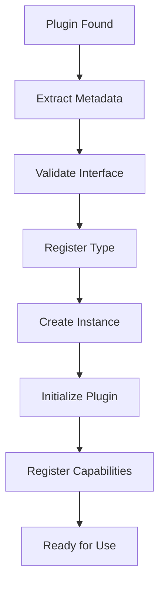

# 🔌 Plugin System Architecture

The plugin system is the heart of RAG Builder, designed to be **zero-configuration**, **ultra-flexible**, and **enterprise-grade**. This document explains how the plugin system works internally and how it achieves its remarkable simplicity and power.

## 🎯 **Core Concepts**

### **Everything is a Plugin**
RAG Builder has **zero built-in functionality**. Every feature runs as a plugin:
- Data processing → Plugin
- LLM integration → Plugin  
- Vector storage → Plugin
- Analytics → Plugin
- Security → Plugin

### **Capabilities, Not Interfaces**
Unlike traditional frameworks that require implementing specific interfaces, RAG Builder uses **capabilities**:

```python
# Traditional framework (complex)
class MyDataSource(IDataSource):
    def get_documents(self) -> List[Document]:
        pass
    def validate_config(self) -> bool:
        pass
    # ... many required methods

# RAG Builder (simple)
def get_documents():
    return [{"id": "1", "content": "Hello"}]

# That's it! Framework auto-discovers this as a capability
```

## 🏗️ **Plugin Architecture Layers**

### **Layer 1: Discovery Engine**

The discovery engine automatically finds plugins without any configuration:

```python
class PluginDiscovery:
    """Finds plugins anywhere in the filesystem"""
    
    def scan_for_plugins(self):
        # 1. Scan filesystem for Python files
        # 2. Check for plugin indicators:
        #    - Functions with docstrings
        #    - Classes inheriting from BasePlugin
        #    - Files with plugin.yaml manifests
        # 3. Load and validate each candidate
        # 4. Register successful plugins
```

#### **Discovery Strategies**

1. **Function-Based Discovery**
   ```python
   # plugins/text_utils.py
   def clean_text(text: str) -> str:
       """Clean and normalize text"""  # Docstring = capability
       return text.strip().lower()
   
   # Auto-discovered as capability "clean_text"
   ```

2. **Class-Based Discovery**
   ```python
   from rag_builder_sdk import QuickPlugin
   
   class TextProcessor(QuickPlugin):
       def process(self, text):  # Public method = capability
           return text.upper()
   
   # Auto-discovered as capability "process"
   ```

3. **Manifest-Based Discovery**
   ```yaml
   # plugin.yaml
   name: "Advanced Text Processor"
   type: "utility"
   entrypoint: "processor.py"
   main_class: "AdvancedProcessor"
   ```

### **Layer 2: Plugin Registry**

The registry manages plugin types and instances:

```python
class PluginRegistry:
    """Central registry for all plugins and capabilities"""
    
    def __init__(self):
        # Plugin type definitions
        self.plugin_types: Dict[str, Type[Plugin]] = {}
        
        # Active plugin instances  
        self.plugin_instances: Dict[str, Plugin] = {}
        
        # Capability mapping
        self.global_capabilities: Dict[str, List[str]] = {}
        
        # Plugin metadata
        self.plugin_metadata: Dict[str, Dict] = {}
```

#### **Registration Process**



### **Layer 3: Capability System**

Every public method or function becomes a capability:

```python
class Capability:
    """Represents a single plugin capability"""
    
    def __init__(self, name: str, handler: Callable, metadata: Dict):
        self.name = name                    # e.g., "generate_text"
        self.handler = handler              # The actual function
        self.metadata = metadata            # Schema, docs, etc.
        self.signature = inspect.signature(handler)
    
    async def execute(self, *args, **kwargs):
        """Execute the capability with proper error handling"""
        if asyncio.iscoroutinefunction(self.handler):
            return await self.handler(*args, **kwargs)
        else:
            return self.handler(*args, **kwargs)
```

#### **Capability Metadata**

```python
# Automatic metadata extraction
def analyze_sentiment(text: str) -> str:
    """Analyze the sentiment of text
    
    Args:
        text: Input text to analyze
        
    Returns:
        Sentiment classification (positive/negative/neutral)
    """
    # Implementation...

# Framework extracts:
capability_metadata = {
    "name": "analyze_sentiment",
    "description": "Analyze the sentiment of text",
    "parameters": ["text"],
    "input_type": "str", 
    "output_type": "str",
    "schema": {...}  # Auto-generated from type hints
}
```

### **Layer 4: Dynamic Routing**

The routing layer intelligently distributes capability calls:

```python
class CapabilityRouter:
    """Routes capability calls to appropriate plugins"""
    
    async def route_call(self, capability: str, *args, **kwargs):
        # 1. Find available providers
        providers = self.get_providers(capability)
        
        # 2. Select best provider
        provider = self.select_provider(providers, strategy="least_used")
        
        # 3. Apply middleware
        args, kwargs = await self.apply_middleware(capability, args, kwargs)
        
        # 4. Execute with monitoring
        result = await self.execute_with_monitoring(provider, *args, **kwargs)
        
        # 5. Cache result if appropriate
        await self.cache_result(capability, args, kwargs, result)
        
        return result
```

#### **Provider Selection Strategies**

```python
class LoadBalancer:
    """Intelligent provider selection"""
    
    def select_provider(self, providers: List[str], strategy: str) -> str:
        if strategy == "round_robin":
            return self.round_robin_selection(providers)
        elif strategy == "least_used":
            return self.least_used_selection(providers)
        elif strategy == "performance":
            return self.performance_based_selection(providers)
        elif strategy == "random":
            return random.choice(providers)
        else:
            return providers[0]  # Default to first available
```

## 🔄 **Plugin Lifecycle**

### **Loading Process**

```python
async def load_plugin(self, plugin_path: str) -> bool:
    """Complete plugin loading process"""
    
    # 1. Discovery
    plugin_info = await self.discover_plugin(plugin_path)
    
    # 2. Validation
    if not await self.validate_plugin(plugin_info):
        return False
    
    # 3. Dependency Resolution
    if not await self.resolve_dependencies(plugin_info):
        return False
    
    # 4. Instantiation
    plugin_instance = await self.create_instance(plugin_info)
    
    # 5. Initialization
    if not await plugin_instance.initialize():
        return False
    
    # 6. Registration
    await self.register_plugin(plugin_instance)
    
    # 7. Event Notification
    await self.emit_event("plugin_loaded", {
        "plugin_id": plugin_instance.plugin_id,
        "capabilities": list(plugin_instance.capabilities.keys())
    })
    
    return True
```

### **Hot Reloading**

```python
async def reload_plugin(self, plugin_id: str) -> bool:
    """Hot reload a plugin without stopping the framework"""
    
    # 1. Save current state
    old_instance = self.get_plugin(plugin_id)
    current_calls = self.get_active_calls(plugin_id)
    
    # 2. Wait for active calls to complete
    await self.wait_for_calls_completion(current_calls, timeout=30)
    
    # 3. Unload old plugin
    await self.unload_plugin(plugin_id, preserve_state=True)
    
    # 4. Reload from source
    success = await self.load_plugin_from_source(plugin_id)
    
    # 5. Restore state if successful
    if success:
        await self.restore_plugin_state(plugin_id, old_instance)
    
    return success
```

### **Cleanup Process**

```python
async def unload_plugin(self, plugin_id: str) -> bool:
    """Safely unload a plugin"""
    
    # 1. Stop accepting new calls
    self.mark_plugin_unavailable(plugin_id)
    
    # 2. Wait for active calls to complete
    await self.wait_for_completion(plugin_id)
    
    # 3. Call plugin cleanup
    plugin = self.get_plugin(plugin_id)
    await plugin.cleanup()
    
    # 4. Remove from registry
    self.remove_from_registry(plugin_id)
    
    # 5. Cleanup resources
    self.cleanup_plugin_resources(plugin_id)
    
    # 6. Emit event
    await self.emit_event("plugin_unloaded", {"plugin_id": plugin_id})
    
    return True
```

## 🔧 **Plugin Types**

### **1. Zero-Config Plugins**

The simplest and most common plugin type:

```python
# plugins/math_utils.py

def add(x: float, y: float) -> float:
    """Add two numbers"""
    return x + y

def multiply(x: float, y: float) -> float:
    """Multiply two numbers"""
    return x * y

def factorial(n: int) -> int:
    """Calculate factorial"""
    if n <= 1:
        return 1
    return n * factorial(n - 1)

# Framework automatically:
# 1. Discovers these functions
# 2. Registers them as capabilities
# 3. Makes them available via API
```

**Framework Processing:**
```python
# Auto-discovery creates:
{
    "add": Capability("add", add_function, metadata),
    "multiply": Capability("multiply", multiply_function, metadata),
    "factorial": Capability("factorial", factorial_function, metadata)
}
```

### **2. Class-Based Plugins**

For more complex functionality:

```python
from rag_builder_sdk import BasePlugin, capability

class AdvancedMathPlugin(BasePlugin):
    """Advanced mathematical operations"""
    
    def __init__(self, **config):
        super().__init__(**config)
        self.precision = config.get("precision", 10)
    
    @capability("Calculate complex mathematical expressions")
    def evaluate_expression(self, expression: str) -> float:
        """Safely evaluate mathematical expressions"""
        # Implementation with safety checks
        return eval(expression, {"__builtins__": {}})
    
    @capability("Generate mathematical sequences")
    def generate_sequence(self, sequence_type: str, length: int) -> List[float]:
        """Generate mathematical sequences"""
        if sequence_type == "fibonacci":
            return self._fibonacci_sequence(length)
        elif sequence_type == "prime":
            return self._prime_sequence(length)
        else:
            raise ValueError(f"Unknown sequence type: {sequence_type}")
    
    def _fibonacci_sequence(self, length: int) -> List[float]:
        """Private helper method (not exposed as capability)"""
        seq = [0, 1]
        for i in range(2, length):
            seq.append(seq[i-1] + seq[i-2])
        return seq[:length]
```

### **3. Specialized Plugin Types**

Framework provides specialized base classes:

```python
from rag_builder_sdk import LLMPlugin, DataSourcePlugin, VectorDBPlugin

class OpenAIPlugin(LLMPlugin):
    """OpenAI LLM integration"""
    
    @capability("Generate text responses")
    async def generate_text(self, prompt: str, **options) -> str:
        response = await openai.chat.completions.create(
            model=self.config["model"],
            messages=[{"role": "user", "content": prompt}],
            **options
        )
        return response.choices[0].message.content

class ChromaDBPlugin(VectorDBPlugin):
    """ChromaDB vector database integration"""
    
    @capability("Store document vectors")
    async def store_vectors(self, documents: List[Dict], embeddings: List[List[float]]) -> bool:
        self.collection.add(
            documents=[doc["content"] for doc in documents],
            embeddings=embeddings,
            ids=[doc["id"] for doc in documents]
        )
        return True
```

## 🎯 **Advanced Features**

### **Plugin Dependencies**

```python
class DependentPlugin(BasePlugin):
    """Plugin that depends on other plugins"""
    
    # Declare dependencies
    dependencies = ["text_cleaner", "sentiment_analyzer"]
    
    @capability("Advanced text analysis")
    @requires("clean_text", "analyze_sentiment")
    async def analyze_text(self, text: str) -> Dict[str, Any]:
        # Framework automatically resolves dependencies
        clean_text = await self.call_dependency("clean_text", text)
        sentiment = await self.call_dependency("analyze_sentiment", clean_text)
        
        return {
            "original": text,
            "cleaned": clean_text,
            "sentiment": sentiment,
            "word_count": len(clean_text.split())
        }
```

### **Plugin Composition**

```python
# Plugins can compose other plugins
class CompositePlugin(BasePlugin):
    """Combines multiple plugins into a workflow"""
    
    @capability("Complete document processing pipeline")
    async def process_document(self, document: str) -> Dict[str, Any]:
        # Chain multiple capabilities
        cleaned = await self.framework.call("clean_text", document)
        chunks = await self.framework.call("split_text", cleaned)
        embeddings = await self.framework.call("generate_embeddings", chunks)
        stored = await self.framework.call("store_vectors", chunks, embeddings)
        
        return {
            "document_id": stored["id"],
            "chunks": len(chunks),
            "processing_time": stored["time"]
        }
```

### **Plugin Communication**

```python
class EventDrivenPlugin(BasePlugin):
    """Plugin that responds to events"""
    
    @event_handler("document_uploaded")
    async def on_document_upload(self, event_data):
        """Automatically process uploaded documents"""
        document = event_data["document"]
        result = await self.framework.call("process_document", document)
        
        # Emit completion event
        await self.framework.emit("document_processed", {
            "document_id": document["id"],
            "result": result
        })
    
    @event_handler("processing_error")
    async def on_error(self, event_data):
        """Handle processing errors"""
        logger.error(f"Processing failed: {event_data['error']}")
        # Implement retry logic or fallback
```

## 📊 **Performance Optimizations**

### **Smart Caching**

```python
class CachingStrategy:
    """Intelligent caching based on capability patterns"""
    
    def should_cache(self, capability: str, args: tuple, kwargs: dict) -> bool:
        # Don't cache capabilities with side effects
        if capability.startswith(("store_", "delete_", "update_", "create_")):
            return False
        
        # Cache expensive operations
        if capability in ["generate_embeddings", "analyze_document", "process_image"]:
            return True
        
        # Cache pure functions
        if self.is_pure_function(capability):
            return True
        
        return False
    
    def generate_cache_key(self, capability: str, args: tuple, kwargs: dict) -> str:
        """Generate deterministic cache key"""
        import hashlib
        key_data = f"{capability}:{str(args)}:{str(sorted(kwargs.items()))}"
        return hashlib.md5(key_data.encode()).hexdigest()
```

### **Load Balancing**

```python
class AdvancedLoadBalancer:
    """Intelligent load balancing with performance awareness"""
    
    def __init__(self):
        self.plugin_stats = {}  # Track performance per plugin
        self.active_calls = {}  # Track active calls per plugin
    
    def select_best_plugin(self, providers: List[str], capability: str) -> str:
        """Select optimal plugin based on performance metrics"""
        
        scores = {}
        for provider in providers:
            stats = self.plugin_stats.get(provider, {})
            
            # Calculate composite score
            avg_response_time = stats.get("avg_response_time", 1000)
            error_rate = stats.get("error_rate", 0.0)
            active_calls = len(self.active_calls.get(provider, []))
            
            # Lower is better for all metrics
            score = (avg_response_time * 0.5 + 
                    error_rate * 1000 * 0.3 + 
                    active_calls * 100 * 0.2)
            
            scores[provider] = score
        
        # Return provider with lowest score
        return min(scores.items(), key=lambda x: x[1])[0]
```

## 🛡️ **Security & Validation**

### **Plugin Validation Pipeline**

```python
class PluginValidator:
    """Multi-stage plugin validation"""
    
    async def validate_plugin(self, plugin: Plugin) -> bool:
        """Complete plugin validation process"""
        
        # 1. Basic validation
        if not await self.basic_validation(plugin):
            return False
        
        # 2. Security validation
        if not await self.security_validation(plugin):
            return False
        
        # 3. Performance validation
        if not await self.performance_validation(plugin):
            return False
        
        # 4. Custom validators
        for validator in self.custom_validators:
            if not await validator(plugin):
                return False
        
        return True
    
    async def security_validation(self, plugin: Plugin) -> bool:
        """Security-focused validation"""
        
        # Check for dangerous imports
        dangerous_modules = ["os", "subprocess", "eval", "exec"]
        plugin_code = inspect.getsource(plugin.__class__)
        
        for module in dangerous_modules:
            if f"import {module}" in plugin_code:
                logger.warning(f"Plugin {plugin.plugin_id} imports dangerous module: {module}")
                return False
        
        # Check for network access (if sandboxing enabled)
        if self.config.get("sandbox_network", False):
            network_modules = ["urllib", "requests", "httpx"]
            for module in network_modules:
                if module in plugin_code:
                    return self.validate_network_access(plugin)
        
        return True
```

---

This plugin system architecture enables RAG Builder to be both incredibly simple for developers (write a function, get a capability) and incredibly powerful for production use (enterprise-grade features, performance, security). The zero-configuration approach combined with advanced features makes it unique in the plugin framework ecosystem.